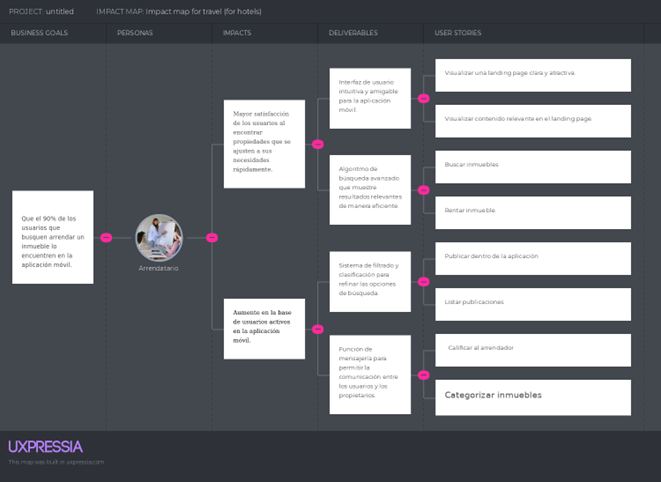
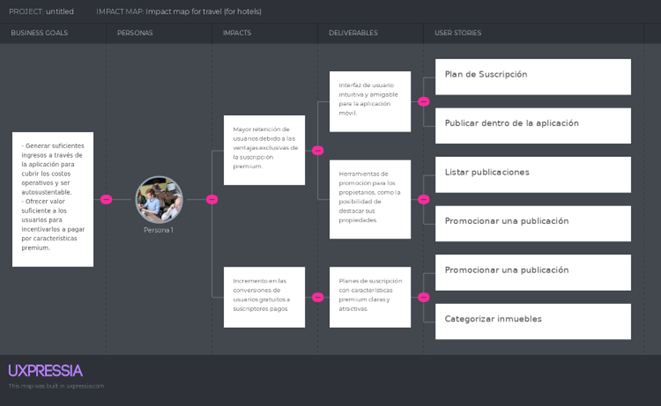

-Capítulo III: Requirements specification 

3.1 To-Be Scenario Mapping 

To-Be Scenario Mapping Cliente 

Segmento 1: Arrendatario

|Phases|Búsqueda de inmueble y roomie|Contactándose con el propietario y el roomie potencial|Pago de alquiler y acuerdos con el roomie|
| :- | :- | :- | :- |
|Doing|Entra a la aplicación donde ya se ha registrado con éxito para buscar un cuarto o inmueble en alquiler, así como un roomie con quien compartir|Envía mensajes tanto al arrendador para acordar una reunión para ver el cuarto en persona, como al roomie potencial para conocerse mejor antes de decidir compartir el espacio.|Realiza el pago del alquiler del cuarto, y coordina con el roomie el pago de los servicios compartidos, asegurándose de que ambos estén al día, gracias a las notificaciones de RoomRest sobre las fechas de vencimiento.|
|Thinking|
- Hay demasiadas opciones y datos específicos del cuarto y de los posibles roomies.

- Miraré las reseñas de los arrendadores y de los roomies para ver cómo son y si son compatibles conmigo.
|
- Espero que tanto el arrendador como el roomie me acepten, porque tengo buen historial de pagos dentro de la aplicación.

|
- Si sigo manteniendo mi racha de buen pagador, tendré un buen historial dentro de RoomRest, lo que también será positivo para encontrar buenos roomies.

|
|Feeling|- Tranquilo y paciente hasta encontrar un cuarto y un roomie de mi agrado.|Alegre y nervioso porque encontré un cuarto de acuerdo con mis exigencias y un roomie con quien compartir.|Feliz y puntual, porque tengo buen tiempo en el cuarto, una buena convivencia con mi roomie, y tener mis pagos al día sin falta.|

Segmento 2: Arrendador

|Phases|Búsqueda de inquilinos|Proceso de Encontrar Inquilinos|Recibiendo alquiler|
| :- | :- | :- | :- |
|Doing|- Publico fotos del inmueble que quiero alquilar en RoomRest y registro datos necesarios o relevantes.|- Al recibir mensajes de posibles inquilinos, entonces puedo comunicarme con ellos y llegar a un acuerdo. |
- Si es necesario, hago recordar al usuario que tiene que ir pagando el alquiler mediante notificaciones.

- Verifica que el depósito se ha realizado en su cuenta bancaria.

- En la aplicación coloca como pago exitoso del mes respectivo.
|
|Thinking|- No creo demorar demasiado en encontrar un inquilino, espero que tenga buena reseña dentro de la aplicación.|- No pensé que sería tan fácil encontrar inquilinos interesados en el inmueble.|
- Bien, todo está de acuerdo con el contrato.

- Tengo suerte de tener un inquilino responsable con los pagos.
|
|Feeling|- Tranquilo hasta encontrar un inquilino que tenga buen historial de pagos.|- Feliz porque conseguí mi primer inquilino.|- Alegre porque acepte un inquilino que tenía una buena calificación en la aplicación y cumple con los pagos.|

User Stories 
-------------
**Epics**

|**Epics ID**|**Título**|**Descripción**|
| :- | :- | :- |
|EP01|Optimización de la experiencia de usuario|Como visitante quiero visualizar una presentación atractiva, fácil de usar y entender para conocer rápidamente los servicios y características que ofrece.|
|EP02|Gestión de cuenta|Como usuario quiero acceder a mi cuenta para entrar a la plataforma y poder realizar cambios a mi perfil.|
|EP03|Gestión de resultados de búsqueda|Como arrendatario quiero que todas las búsquedas que realice sean eficientes y efectivas para encontrar rápidamente lo que necesito.|
|EP04|Gestión de registros|Como arrendador quiero gestionar y optimizar mis registros de clientes y propiedades en la plataforma para tener un control eficiente sobre ellos.|
|EP05|Gestión de mensajería|Como usuario quiero que la gestión de mensajes sea eficiente y fácil de usar para recibir información relevante y rápido.|
|EP06|Gestión de calificaciones|Como usuario quiero visualizar mi calificación y calificar a mis arrendatarios o arrendadores para que los demás usuarios tengan referencias.|
|EP07|Gestión de publicaciones|Como arrendador quiero crear, editar y publicar anuncios para poder mostrarlos a posibles arrendatarios.|
|EP08|Gestión de suscripción y anuncios|Como arrendador quiero poder tener la opción de promocionar mi inmueble y así llegar a más personas.|
|EP09|Gesión de notificaciones|Como usuario quiero recibir notificaciones sobre las solicitudes de alquiler y confirmaciones de renta de un inmueble para estar informado sobre el proceso de alquiler.|

**User Stories**

|**ID**|**USER**|**PRIORITY**|**EPIC**|
| :-: | :-: | :-: | :-: |
|US01|Visitante del Landing Page|Medium|EP01|
|**TITLE**|Visualizar una Landing page clara y atractiva.|||
|**DESCRIPTION**||||
|Como visitante, quiero ver una Landing page clara y atractiva para que pueda entender rápidamente el propósito de la aplicación.||||
|**ACCEPTANCE CRITERIA**||||
|
**Escenario 01:** Visitante visualiza una Landing page clara y atractiva

Dado que el visitante ve la Landing page con imágenes, videos e información relevante

Cuando complete el proceso de registro y login

Entonces será redirigido a la tienda para descargar la aplicación

**Escenario 02**: Visitante no visualiza una Landing page clara y atractiva

Dado que el visitante visualiza una Landing page sin imágenes, videos e información relevante

Cuando no vea estas características

Entonces cierra la ventana y sigue navegando en internet.
||||

|**ID**|**USER**|**PRIORITY**|**EPIC**|
| :-: | :-: | :-: | :-: |
|US02|Visitante del Landing Page|Medium|EP01|
|**TITLE**|Visualizar una sección sobre nosotros en el Landing page.|||
|**DESCRIPTION**||||
|Como visitante, quiero ver una sección en el Landing page que me informe sobre el startup para saber el propósito y con quiénes estoy tratando al momento de usar su aplicación.||||
|**ACCEPTANCE CRITERIA**||||
|
**Escenario 01:** El usuario visualiza una sección sobre el startup en el Landing page

Dado que el usuario ha accedido a la landing page

Cuando le de click a la sección “About us”

Entonces puede ver información y entender el propósito de nuestro startup.

**Escenario 02:** El usuario no visualiza una sección sobre nosotros en la Landing page

Dado que el usuario no visualiza una sección sobre el startup

Cuando note esta falta de información

Entonces cierra la ventana del Landing page y sigue navegando por internet.
||||

|**ID**|**USER**|**PRIORITY**|**EPIC**|
| :-: | :-: | :-: | :-: |
|US-03|Visitante del Landing Page|Medium|EP01|
|**TITLE**|Visualizar contenido relevante en el Landing page.|||
|**DESCRIPTION**||||
|Como usuario, quiero que la Landing page tenga contenido relevante para que pueda tomar una decisión informada.||||
|**ACCEPTANCE CRITERIA**||||
|
**Escenario 01:**

El usuario visualiza un contenido relevante en el Landing page

Dado que el usuario visualiza contenido relevante en la Landing page

Cuando se registré dentro del Landing page

Entonces será redirigido a la aplicación para registrarse.

**Escenario 02:**

El usuario visualiza información dudosa en el Landing page

Dado que el usuario visualiza información irrelevante

Cuando termine de revisar el Landing page

Entonces decide cerrar la Landing page y sigue navegando en internet.
||||

|**ID**|**USER**|**PRIORITY**|**EPIC**|
| :-: | :-: | :-: | :-: |
|US-04|Potencial cliente|Medium|EP01|
|**TITLE**|Acceder desde cualquier dispositivo a la Landing page.|||
|**DESCRIPTION**||||
|Como usuario, quiero que la Landing page sea accesible desde diferentes dispositivos para que pueda conocer de la aplicación desde cualquier lugar.||||
|**ACCEPTANCE CRITERIA**||||
|
**Escenario 01:** El usuario accede al contenido del Landing page desde cualquier dispositivo

Dado que la Landing page es responsive

Cuando el usuario ingresa a nuestra Landing page

Entonces podrá visualizar la información de manera organizada, adaptada al tamaño de pantalla que esté utilizando.

**Escenario 02:** El usuario accede al Landing page, pero no es responsive con cualquier dispositivo

Dado que el usuario está ingresando al Landing page desde otro dispositivo

Cuando revise la información, lo notará desordenado y desagradable para la vista

Entonces cierra nuestra Landing page y se dedica a seguir navegando por internet.
||||

|**ID**|**USER**|**PRIORITY**|**EPIC**|
| :-: | :-: | :-: | :-: |
|US-05|Startup|Medium|EP01|
|**TITLE**|Desplegar la Landing page|||
|**DESCRIPTION**||||
|Como startup, quiero desplegar una Landing page para informar sobre nuestra aplicación||||
|**ACCEPTANCE CRITERIA**||||
|
**Escenario 01:** Éxito en el despliegue de la Landing page

Dado que la Landing page está listo

Cuando se despliegue la Landing page en Github Pages

Entonces cualquier usuario de internet que tenga el URL o decida indagar en la web, podrá visualizar nuestra Landing page.

**Escenario 02:** Landing page no está listo para el despliegue

Dado que el startup no puede desplegar la Landing page

Cuando esta no cumple con los requisitos del startup 

Entonces nadie podrá visualizar la Landing page y será un retraso para poder informar sobre nuestra aplicación.
||||

|**ID**|**USER**|**PRIORITY**|**EPIC**|
| :-: | :-: | :-: | :-: |
|US-06|Arrendatario|High|EP03|
|**TITLE**|Buscar inmuebles|||
|**DESCRIPTION**||||
|Como arrendatario quiero que la aplicación me ayude a encontrar inmuebles para tener diferentes opciones de acuerdo con mis necesidades.||||
|**ACCEPTANCE CRITERIA**||||
|
**Escenario 01:** El arrendatario busca un inmueble y encuentra resultados

Dado que el arrendatario desea buscar un inmueble para arrendar

Cuando acceda a la barra de búsqueda

Y coloque la ubicación deseada

Y hace clic en el botón “Search”

Entonces se ejecuta la búsqueda de un inmueble basada en esa ubicación 

Y se muestra una lista de resultados que coincidan.

**Escenario 02:** El arrendatario busca un inmueble y no encuentra resultados

Dado que el arrendatario quiere buscar un inmueble para arrendar

Cuando acceda a la barra de búsqueda

Y coloque la ubicación deseada

Y hace clic en el botón “Search”

Entonces no se ejecuta la búsqueda de inmuebles basada en la ubicación Y se muestra un mensaje informando que no hay resultados disponibles
||||

|**ID**|**USER**|**PRIORITY**|**EPIC**|
| :-: | :-: | :-: | :-: |
|US-07|Arrendatario|High|EP04|
|**TITLE**|Rentar inmueble.|||
|**DESCRIPTION**||||
|Como arrendatario quiero reservar un inmueble para rentar el inmueble.||||
|**ACCEPTANCE CRITERIA**||||
|
**Escenario 01: Reservar inmueble** 

Dado que el arrendatario quiere reservar un inmueble

Cuando visualiza una publicación que le interesa

Y da clic en “Send request” luego de rellenar el formulario requerido

Entonces el sistema procesa la reserva y confirma la solicitud del arrendatario

**Escenario 02: Confirmar renta**

Dado que el arrendador ha recibido una solicitud de reserva

Cuando ambos usuarios hayan llegado a un acuerdo sobre la renta

Y el arrendador de clic en “Confirm request”

Entonces el arrendador confirma la renta a través del sistema

Y el arrendatario recibe una notificación de confirmación
||||

|**ID**|**USER**|**PRIORITY**|**EPIC**|
| :-: | :-: | :-: | :-: |
|US-08|Arrendador|Medium|EP04|
|**TITLE**|Visualizar arrendatarios.|||
|**DESCRIPTION**||||
|Como arrendador quiero visualizar a mis clientes en la aplicación para tener la información organizada de cada uno de ellos.||||
|**ACCEPTANCE CRITERIA**||||
|
**Escenario 01:  Visualizar lista de arrendatarios**

Dado que el arrendador quiere visualizar la lista de arrendatarios

Cuando el arrendador vaya a su perfil

Y le da clic en “Customers”

Entonces podrá visualizar información sobre sus actuales arrendatarios

**Escenario 02:  Visualizar lista de solicitudes**

Dado que el arrendador quiere visualizar la lista de solicitudes de sus propiedades

Cuando el arrendador vaya a la pantalla de inicio

Y le da clic al ícono de la campana

Entonces podrá visualizar la lista de solicitudes que ha recibido
||||

|**ID**|**USER**|**PRIORITY**|**EPIC**|
| :-: | :-: | :-: | :-: |
|US-09|Arrendador|High|EP08|
|**TITLE**|Publicar dentro de la aplicación|||
|**DESCRIPTION**||||
|Como arrendador, quiero realizar publicaciones dentro de la aplicación para que renten mis inmuebles.||||
|**ACCEPTANCE CRITERIA**||||
|
**Escenario 01:** Publicar un inmueble

Dado que el arrendador está registrado dentro de la aplicación

Y desea publicar un inmueble para arrendar

Cuando de clic en el ícono “+” en la barra de navegación

Entonces el arrendador es redirigido a una pantalla con un formulario para crear una publicación

**Escenario 02:** Validar Publicación

Dado que el arrendador está registrado dentro de la aplicación

Y ha ingresado los datos del inmueble en el formulario de publicación

Cuando haga clic en el botón "Post"

Y ya haya llenado todos los campos requeridos del formulario

Entonces le aparecerá un mensaje de "Registered post".
||||

|**ID**|**USER**|**PRIORITY**|**EPIC**|
| :-: | :-: | :-: | :-: |
|US-10|Arrendador|High|EP07|
|**TITLE**|Administrar mis publicaciones|||
|**DESCRIPTION**||||
|Como arrendador quiero administrar mis publicaciones para tener organizado mi lista de publicaciones.||||
|**ACCEPTANCE CRITERIA**||||
|
**Escenario 01:** Eliminar publicación

Dado que el arrendador ha realizado una publicación

Y no quiera seguir rentando el inmueble

Cuando haga clic en el ícono en forma de un tacho de basura

Entonces la publicación se elimina del perfil del arrendador.

Y ya no aparecerá en su lista de publicaciones 

**Escenario 02:** Editar publicación

Dado que el arrendador ya realizó una publicación

Y ve que hay algún campo que se necesite actualizar o que contiene errores

Cuando presione en el ícono en forma de lápiz

Entonces podrá actualizar los campos que desee de la publicación

Y cuando le dé al botón "Save"

Entonces los campos se guardarán con los últimos cambios.

Y la publicación se actualizará con la nueva información.
||||

|**ID**|**USER**|**PRIORITY**|**EPIC**|
| :-: | :-: | :-: | :-: |
|US-11|Arrendatario y Arrendador|High|EP06|
|**TITLE**|Calificar al arrendador|||
|**DESCRIPTION**||||
|Como usuario quiero calificar el perfil del arrendador para que sirva de referencia a otros usuarios.||||
|**ACCEPTANCE CRITERIA**||||
|
**Escenario 01:** Calificar arrendador

Dado que el arrendador está registrado dentro de la aplicación

Y el usuario quiere calificar a un arrendador

Cuando presione en el ícono del perfil del Arrendador 

Y seleccione la cantidad de estrellas según su criterio

Cuando presione en el botón "Confirm"

Entonces la calificación del arrendador se guarda en el sistema

Y el arrendador ve la calificación en su perfil

**Escenario 02:** Editar la calificación

Dado que el usuario se equivocó al ingresar la calificación del arrendador

Y quiera cambiar la cantidad de estrellas calificadas

Cuando vuelva a seleccionar la nueva cantidad de estrellas

Y haga clic en el botón "Save"

Entonces la cantidad de estrellas se actualizará

Y el arrendador verá la calificación actualizada en su perfil
||||

|**ID**|**USER**|**PRIORITY**|**EPIC**|
| :-: | :-: | :-: | :-: |
|US-12|Usuario|High|EP03|
|**TITLE**|Filtrar inmuebles|||
|**DESCRIPTION**||||
|Como usuario quiero visualizar los inmuebles por categorías para encontrar con facilidad un inmueble.||||
|**ACCEPTANCE CRITERIA**||||
|
**Escenario 01:** Usuario encuentra resultados

Dado que el usuario necesita rentar un inmueble en específico

Y en las publicaciones solo visualiza inmuebles de otras categorías

Cuando haga clic en la barra superior en el botón de acuerdo con la categoría que busque

Entonces se mostrará los inmuebles de la categoría seleccionada

**Escenario 02:** El usuario no encuentra resultado

Dado que el usuario necesita ver inmuebles de una categoría en específico

Y en las publicaciones solo visualiza inmuebles de otras categorías

Cuando haga clic en la barra superior en el botón de acuerdo con la categoría que busque

Y no haya resultados que coincidan

Entonces no visualizará inmuebles de la categoría seleccionada.
||||

|**ID**|**USER**|**PRIORITY**|**EPIC**|
| :-: | :-: | :-: | :-: |
|US-13|Usuario|Medium|EP02|
|**TITLE**|Crear mi perfil en la aplicación|||
|**DESCRIPTION**||||
|Como usuario de la app quiero crear mi cuenta para acceder a todos los servicios de la aplicación.||||
|**ACCEPTANCE CRITERIA**||||
|
**Escenario 01:** El usuario crea un perfil exitosamente 

Dado que el usuario está en la página de creación de cuenta o perfil

Y este ya haya llenado los campos requeridos

Cuando el usuario presione en el botón "Register"

Entonces la aplicación guardará sus datos y su perfil.

**Escenario 02:** El usuario no completa todos los campos requeridos

Dado que el usuario está en la página de creación de perfil

Cuando el usuario no complete los campos requeridos

Entonces el sistema no crea el perfil

Y solicitará llenar los campos faltantes

**Escenario 03:** El usuario visualiza el perfil creado

Dado que el usuario ha creado un perfil de manera exitosa

Y el usuario quiere ver su perfil

Cuando haga clic en el ícono de una persona

Entonces es redirigido a una vista donde se encuentra los campos que llenó en un inicio.

**Escenario 04:** El usuario edita su perfil

Dado que el usuario ha creado su perfil exitosamente

Y quiere cambiar un campo de su perfil

Cuando presione en el ícono en forma de lápiz

Entonces puede cambiar la información del campo respectivo

Y haga clic al botón "Save"

Entonces los datos se actualizan y se muestra el cambio en su perfil.

**Escenario 05:** Eliminar perfil

Dado que el usuario ha creado un perfil exitosamente

Cuando quiera eliminar su cuenta

Y le da clic en el ícono de la persona 

Y es redirigido a su perfil

Cuando haga clic en el botón "Delete Account"

Entonces su cuenta se elimina de los registros.
||||
|**ID**|**USER**|**PRIORITY**|**EPIC**|
|US-14|Startup|Medium|EP08|
|**TITLE**|Plan de suscripción|||
|**DESCRIPTION**||||
|Como startup quiero que mis usuarios tengan un plan de suscripción para generar ganancias y poder realizar un buen mantenimiento de la aplicación.||||
|**ACCEPTANCE CRITERIA**||||
|
**Escenario 01:** Arrendador decide pagar el plan de suscripción

Dado que el arrendador está registrado dentro de la aplicación

Y haga clic en el apartado de suscripción

Y mira todas las ventajas de la suscripción

Cuando haga clic en el botón "Pay"

Entonces procede a realizar la transacción.

**Escenario 02:** Arrendador no quiere pagar el plan de suscripción

Dado que el arrendador está registrado dentro de la aplicación

Y haga clic en el apartado de suscripción

Y mira todas las ventajas de la suscripción

Y no tenga interés en el plan de suscripción

Cuando haga clic en el botón "Back"

Entonces regresa a la sección de "Posts"
||||

|**ID**|**USER**|**PRIORITY**|**EPIC**|
| :-: | :-: | :-: | :-: |
|US-15|Arrendador|High|EP08|
|**TITLE**|Promocionar una publicación|||
|**DESCRIPTION**||||
|Como arrendador quiero promocionar mi publicación y que este se vea al inicio de la lista para que más personas lo vean.||||
|**ACCEPTANCE CRITERIA**||||
|
**Escenario 01:** Arrendador va a pagar para publicitar su publicación

Dado que el arrendador quiere que más personas vean su inmueble en renta

Y está dispuesto a pagar para que esto se cumpla

Cuando vaya a la ventana de suscripciones

Y haya realizado la transacción

Entonces sus publicaciones se mostrarán con prioridad en la sección de "posts".
||||

|**ID**|**USER**|**PRIORITY**|**EPIC**|
| :-: | :-: | :-: | :-: |
|US-16|Arrendador|High|EP07|
|**TITLE**|Tomar fotos del inmueble|||
|**DESCRIPTION**||||
|Como arrendador quiero tomar fotografías del inmueble desde la aplicación para que los arrendatarios puedan tener una referencia del inmueble.||||
|**ACCEPTANCE CRITERIA**||||
|
**Escenario 01:** Arrendador toma fotografía del inmueble

Dado que el arrendador quiere tomar fotografías del inmueble que desea rentar

Y se encuentra en el formulario de publicación

Cuando presione el icono de la “cámara”

Y le aparezca el mensaje de permiso

Y presione “ALLOW”

Entonces podrá tomar fotos desde la aplicación.

**Escenario 02:** Arrendador deniega el permiso de la cámara

Dado que el arrendador quiere tomar fotografías del inmueble que desea rentar

Y se encuentra en el formulario de publicación

Cuando presione el icono de la “cámara”

Y le aparezca el mensaje de permiso

Y presione “DECLINE”

Entonces no podrá tomar fotos desde la aplicación.

||||

|**ID**|**USER**|**PRIORITY**|**EPIC**|
| :-: | :-: | :-: | :-: |
|US-17|Arrendatario|High|EP03|
|**TITLE**|Buscar roomies|||
|**DESCRIPTION**||||
|Como arrendatario, quiero buscar compañeros de cuarto que compartan mis intereses y preferencias para tener una convivencia armoniosa.||||
|**ACCEPTANCE CRITERIA**||||
|
Escenario 01: Usuario encuentra roomies compatibles 

Dado que el usuario necesita encontrar un compañero de cuarto que comparta sus intereses y estilo de vida. Y ha ingresado sus preferencias de búsqueda en la aplicación. 

Cuando hace clic en el botón de búsqueda 

Y selecciona sus filtros

Entonces la aplicación mostrará una lista de roomies potenciales que coinciden con sus preferencias. 

 

Escenario 02: El usuario no encuentra roomies compatibles 

 

Dado que el usuario necesita encontrar un compañero de cuarto que comparta sus intereses y estilo de vida. Y no hay roomies disponibles que coincidan con las preferencias de búsqueda ingresadas. 

Cuando hace clic en el botón de búsqueda 

Y selecciona sus filtros

Entonces, la aplicación no mostrará resultados 

Y sugerirá ampliar los filtros de búsqueda.
||||

|**ID**|**USER**|**PRIORITY**|**EPIC**|
| :-: | :-: | :-: | :-: |
|US-18|Arrendatario|High|EP02|
|**TITLE**|Crear perfil de roomie|||
|**DESCRIPTION**||||
|Como arrendatario, quiero crear un perfil que incluya mis preferencias y estilo de vida para encontrar un roomie compatible.||||
|**ACCEPTANCE CRITERIA**||||
|
Escenario 01: Usuario crea su perfil con éxito

 

Dado que el usuario necesita crear un perfil para encontrar un compañero de cuarto compatible.

Y ha completado el formulario de perfil en la aplicación con sus preferencias y estilo de vida.

Cuando hace clic en el botón “Save” después de completar el formulario.

Entonces, su perfil será guardado exitosamente en la base de datos y estará disponible para otros usuarios.

Escenario 02: Usuario no completa el perfil

Dado que el usuario necesita crear un perfil para encontrar un compañero de cuarto compatible.

Y no ha completado todos los campos obligatorios en el formulario de perfil.

Cuando hace clic en el botón “Save”.

Entonces, la aplicación mostrará un mensaje de error indicando que se deben completar todos los campos obligatorios antes de guardar el perfil.
||||

|**ID**|**USER**|**PRIORITY**|**EPIC**|
| :-: | :-: | :-: | :-: |
|US-19|Arrendatario|High|EP03|
|**TITLE**|Ver perfil de posibles roomies|||
|**DESCRIPTION**||||
|Como arrendatario, quiero ver los perfiles de posibles roomies antes de tomar una decisión para asegurarme de que son compatibles conmigo.||||
|**ACCEPTANCE CRITERIA**||||
|
Escenario 01: Usuario visualiza el perfil de un roomie

 

Dado que el usuario está buscando un compañero de cuarto compatible.

Y ha encontrado un perfil de roomie que parece interesante.

Cuando hace clic en el nombre o la imagen del roomie en la lista de resultados.

Entonces, se abrirá una vista detallada del perfil del roomie con toda la información relevante.

Escenario 02: Usuario no puede visualizar el perfil del roomie

 

Dado que el usuario está buscando un compañero de cuarto compatible.

Y ha encontrado un perfil de roomie que parece interesante.

Cuando hace clic en el nombre o la imagen del roomie en la lista de resultados.

Entonces, si hay un problema técnico, la aplicación mostrará un mensaje de error y sugerirá intentar nuevamente más tarde.
||||

|**ID**|**USER**|**PRIORITY**|**EPIC**|
| :-: | :-: | :-: | :-: |
|US-20|Arrendatario|High|EP03|
|**TITLE**|Filtrar roomies|||
|**DESCRIPTION**||||
|Como arrendatario, quiero que la aplicación me muestre roomies compatibles según los filtros seleccionados para facilitar la búsqueda de compañero de cuarto.||||
|**ACCEPTANCE CRITERIA**||||
|
Escenario 01: Usuario selecciona filtros para buscar roomies

 

Dado que el usuario ha creado un perfil y se encuentra en la sección de búsqueda de roomies

Cuando selecciona los botones de filtros de búsqueda según las características que busca en un compañero de cuarto

Entonces, la aplicación mostrará una lista de roomies sugeridos que cumplen con los criterios seleccionados.

Escenario 02: Usuario no recibe sugerencias de roomies compatibles

 

Dado que el usuario ha creado un perfil y ha seleccionado filtros de búsqueda para un compañero de cuarto 

Y no hay roomies disponibles que sean compatibles con los filtros seleccionados

Cuando el usuario da clic en “Buscar”

Entonces, la aplicación mostrará un mensaje indicando que no hay sugerencias disponibles
||||

|**ID**|**USER**|**PRIORITY**|**EPIC**|
| :-: | :-: | :-: | :-: |
|US-21|Arrendador / Arrendatario|Medium|EP05|
|**TITLE**|` `Enviar mensajes a otros usuarios|||
|**DESCRIPTION**||||
|Como usuario, quiero enviar mensajes a otros usuarios para comunicarme con ellos sobre el alquiler.||||
|**ACCEPTANCE CRITERIA**||||
|
**Escenario 01:** El usuario arrendatario se comunica con el arrendador.

Dado que el usuario está registrado y ha encontrado un inmueble 

Y accede a la publicación del inmueble y selecciona “Ver perfil del autor”

Cuando selecciona la opción de “Enviar mensaje”

Entonces puede iniciar una conversación con el propietario del inmueble.

**Escenario 02:** Comunicación entre usuarios interesados en ser roomies.

Dado que el usuario está registrado y ha encontrado un roomie

Y selecciona en el botón de “Más información” del roomie

Cuando ingresa a su perfil y selecciona “Enviar mensaje”

Entonces puede iniciar una conversación con el usuario.
||||

|**ID**|**USER**|**PRIORITY**|**EPIC**|
| :-: | :-: | :-: | :-: |
|US-22|Arrendador / Arrendatario|High|EP09|
|**TITLE**|Recibir notificaciones|||
|**DESCRIPTION**||||
|Como usuario, quiero recibir notificaciones para estar informado de las actualizaciones relacionadas con mis publicaciones o solicitudes.||||
|**ACCEPTANCE CRITERIA**||||
|
**Escenario 01:** El usuario arrendador recibe notificación de nueva solicitud de arrendamiento

Dado que el usuario tiene inmuebles publicados

Cuando un arrendatario realice una nueva solicitud para alquilar uno de los inmuebles y el usuario acceda al ícono de la campanita de notificaciones

Entonces visualizará en detalle la notificación.

**Escenario 02:** El usuario arrendatario recibe notificación de aceptación de solicitud

Dado que el usuario ha enviado una solicitud para arrendar un inmueble

Cuando el arrendador acepte la solicitud y el usuario acceda al ícono de la campanita de notificaciones

Entonces visualizará en detalle la notificación.
||||

|**ID**|**USER**|**PRIORITY**|**EPIC**|
| :-: | :-: | :-: | :-: |
|US-23|Arrendatario|High|EP05|
|**TITLE**|Enviar información de roomies|||
|**DESCRIPTION**||||
|Como arrendatario, quiero enviar la información de mis compañeros de cuarto en mi solicitud de alquiler para facilitar el proceso de selección del arrendador.||||
|**ACCEPTANCE CRITERIA**||||
|
**Escenario 01:** 

Dado que el arrendatario desea enviar una solicitud al arrendador

Y seleccionó más de un inquilino

Y ha agregado la información de sus compañeros de cuarto

Cuando hace clic en el botón “Send request”

Entonces la aplicación envía la solicitud junto con la información de los roomies al arrendador

Y muestra un mensaje de confirmación indicando que la solicitud ha sido enviada con éxito

**Escenario 02:** 

Dado que el arrendatario desea enviar una solicitud al arrendador

Y seleccionó más de un inquilino

Cuando hace clic en “Send request” sin haber completado la información de todos sus compañeros de cuarto

Entonces la aplicación muestra un mensaje de error indicando los campos faltantes
||||

|**ID**|**USER**|**PRIORITY**|**EPIC**|
| :-: | :-: | :-: | :-: |
|US-24|Arrendador|Medium|EP07|
|**TITLE**|Editar publicaciones|||
|**DESCRIPTION**||||
|Como arrendador, quiero poder editar mis publicaciones de alquiler en la aplicación para corregir o actualizar la información.||||
|**ACCEPTANCE CRITERIA**||||
|
**Escenario 01:** Editar una publicación exitosamente

Dado que el arrendador ha creado una publicación de alquiler existente 

Cuando el arrendador selecciona la opción "Editar" en la publicación 

Entonces la aplicación permitirá realizar los cambios y actualizará la publicación con la información nueva.

**Escenario 02:** Editar una publicación sin cambios

Dado que el arrendador ha accedido a la opción de editar una publicación

Cuando el arrendador selecciona el botón "Guardar"

Entonces la aplicación mostrará un mensaje indicando que no se han realizado cambios.

**Escenario 03:** Error al editar la publicación

Dado que el arrendador está intentando editar una publicación

Cuando el arrendador selecciona "Guardar"

Entonces la aplicación mostrará un mensaje de error y no se guardarán los cambios.
||||

|**ID**|**USER**|**PRIORITY**|**EPIC**|
| :-: | :-: | :-: | :-: |
|US-25|Arrendador / Arrendatario|Medium|EP02|
|**TITLE**|Editar perfil de usuario|||
|**DESCRIPTION**||||
|Como usuario , quiero poder editar mi perfil para mantener mi información actualizada, lo que me permitirá tener un mejor control sobre mis datos y facilitar la comunicación con otras partes. .||||
|**ACCEPTANCE CRITERIA**||||
|
**Escenario 01:** El usuario edita su información básica

Dado que el usuario desea actualizar su nombre, dirección y número de teléfono en su perfil

Cuando el usuario edita estos campos y hace clic en el botón "Guardar"

Entonces la aplicación debe actualizar su perfil con la nueva información y mostrar un mensaje de confirmación.

**Escenario 02:** El usuario intenta guardar sin completar datos obligatorios

Dado que el usuario está en la sección de editar perfil

Cuando el usuario intenta guardar los cambios haciendo clic en el botón "Guardar" sin completar los campos obligatorios

Entonces debe aparecer un mensaje de error que indique que los campos obligatorios deben ser llenados.

**Escenario 03:** El usuario cancela la edición de su perfil

Dado que el usuario está editando su perfil

Cuando el usuario hace clic en el botón "Cancelar"

Entonces debe regresar a la vista del perfil sin perder los cambios realizados anteriormente.
||||

|` `**ID**|**USER**|**PRIORITY**|**EPIC**|
| :-: | :-: | :-: | :-: |
|TS-01|Desarrollador|Medium||
|**TITLE**|Configuración de la Base de Datos|||
|**DESCRIPTION**||||
|Como desarrollador, quiero configurar una base de datos para almacenar información de usuarios y propiedades.||||
|**ACCEPTANCE CRITERIA**||||
|
**Escenario 01:** La creación de tablas se realizó de manera exitosa

Dado que la base de datos está vacía

Cuando ejecuto el script de creación de la base de datos

Entonces las tablas de usuarios y propiedades se crean sin errores.

**Escenario 02:** Se agregó un nuevo campo a la tabla correctamente

Dado que la base de datos ya tiene tablas existentes

Cuando se agrega un nuevo campo a una tabla existente

Entonces el nuevo campo se agrega correctamente a la estructura de la tabla.

**Escenario 03:** La tabla se eliminó sin problemas.

Dado que la base de datos tiene tablas creadas

Cuando se ejecuta un script para eliminar las tablas

Entonces las tablas se eliminan de la base de datos sin problemas.
||||

|**ID**|**USER**|**PRIORITY**|**EPIC**|
| :-: | :-: | :-: | :-: |
|TS-02|Desarrollador|Medium||
|**TITLE**|Sistema de Autenticación y Registro|||
|**DESCRIPTION**||||
|Como desarrollador quiero implementar un sistema de autenticación y registro.||||
|**ACCEPTANCE CRITERIA**||||
|
**Escenario 01:** El desarrollador implementa autenticación

Dado que quiero garantizar la seguridad de la aplicación

Cuando implemento el sistema de autenticación

Entonces debería permitir a los usuarios registrarse e iniciar sesión de manera segura

**Escenario 02:** El usuario se registra de manera exitosa

Dado que el bounded context de seguridad está completo

Cuando un usuario nuevo completa el proceso de registro en la aplicación.

**Escenario 03:** La aplicación responde al manejo de errores en el registro

Dado que un usuario intenta registrarse, pero proporciona datos incorrectos e incompletos

Cuando el usuario intenta enviar el formulario de registro

Entonces la aplicación muestra mensajes de error adecuados para guiar al usuario a corregir los campos incorrectos o faltantes.
||||

|**ID**|**USER**|**PRIORITY**|**EPIC**|
| :-: | :-: | :-: | :-: |
|TS-03|Desarrollador|High||
|**TITLE**|Integración de API de Mapas|||
|**DESCRIPTION**||||
|Como desarrollador quiero integran una API de mapas para mostrar las ubicaciones de las propiedades.||||
|**ACCEPTANCE CRITERIA**||||
|
**Escenario 01:** Mostrar ubicación en el mapa

Dado que la propiedad tiene información de ubicación disponible

Cuando se carga la página de detalles de la propiedad

Entonces la ubicación de la propiedad se muestra con un marcador en el mapa.

**Escenario 02:** Cambio de ubicación

Dado que una propiedad tiene una ubicación anterior

Cuando el propietario actualiza la ubicación de la propiedad

Entonces la ubicación en el mapa se actualiza y muestra la nueva ubicación.

**Escenario 03:** Propiedad con ubicación incorrecta o inexacta

Dado que una propiedad no tiene información de ubicación exacta o es incorrecta

Cuando se carga la página de detalles de la propiedad

` `Entonces no se muestra ningún mapa en la página y se indica el error de información
||||

|**ID**|**USER**|**PRIORITY**|**EPIC**|
| :-: | :-: | :-: | :-: |
|TS-04|Desarrollador|High||
|**TITLE**|Funcionalidad de Búsqueda Avanzada|||
|**DESCRIPTION**||||
|Como desarrollador, quiero desarrollar la funcionalidad de búsqueda avanzada con filtros.||||
|**ACCEPTANCE CRITERIA**||||
|
**Escenario 01:** Configuración de filtros

Dado que se tienen diferentes propiedades almacenadas en la base de datos

Cuando el desarrollador trabaje en la funcionalidad de búsqueda avanzada

Entonces el desarrollador crea consultas SQL personalizadas para filtrar propiedades según los criterios de búsqueda especificados como ubicación y rango de precios.

**Escenario 02:** Interfaz de filtros

Dado que los usuarios necesitan una forma intuitiva de establecer los filtros de búsqueda avanzada

Cuando el desarrollador implemente la interfaz de usuario para la búsqueda avanzada

Entonces el desarrollador crea componentes de filtro en la interfaz que permiten a los usuarios elegir criterios.

**Escenario 03:** Visualización de resultados

Dado que se requiere una forma eficiente de presentar los resultados de la búsqueda

Cuando el desarrollador trabaje en la visualización de los resultados

Entonces el desarrollador diseña una página de resultados que muestra las propiedades de manera ordenada.
||||

|**ID**|**USER**|**PRIORITY**|**EPIC**|
| :-: | :-: | :-: | :-: |
|TS-05|Desarrollador|High||
|**TITLE**|Implementación de mensajería|||
|**DESCRIPTION**||||
|Como desarrollador, quiero implementar un sistema de mensajería para que los usuarios puedan comunicarse en la plataforma.||||
|**ACCEPTANCE CRITERIA**||||
|
**Escenario 01:** Tabla de mensajes 

Dado que los usuarios deben poder enviar y recibir mensajes en tiempo real.

Cuando el desarrollador configure la mensajería

Entonces el desarrollador integra en la aplicación la comunicación en tiempo real entre usuarios.

**Escenario 02:** Tabla de mensajes

Dado que los mensajes deben estar asociados correctamente con los usuarios y las conversaciones

Cuando el desarrollador diseñe la estructura de datos para la mensajería

Entonces el desarrollador crea tablas en la base de datos que almacenan información sobre mensajes, conversaciones, remitentes y destinatarios.
||||

|**ID**|**USER**|**PRIORITY**|**EPIC**|
| :-: | :-: | :-: | :-: |
|TS-06|Desarrollador|Medium||
|**TITLE**|Optimización del rendimiento de la aplicación|||
|**DESCRIPTION**||||
|Como desarrollador, quiero optimizar el rendimiento de la aplicación para una experiencia rápida y fluida.||||
|**ACCEPTANCE CRITERIA**||||
|
**Escenario 01:** Carga rápida de propiedades

Dado que un usuario navega por la lista de propiedades

Cuando desplaza hacia abajo o arriba

Entonces la carga de propiedades y las imágenes deben ser suaves y sin retrasos visibles.

**Escenario 02:** Carga rápida entre pantallas

Dado que un usuario cambia entre pantallas de manera rápida

Cuando navega por la aplicación

Entonces no debe haber problemas de carga o bloqueo.

**Escenario 02:** Rendimiento óptimo

Dado que un usuario abre la aplicación después de un periodo de inactividad 

Cuando la aplicación se reanuda

Entonces debe cargar rápidamente sin demoras perceptibles.
||||

|**ID**|**USER**|**PRIORITY**|**EPIC**|
| :-: | :-: | :-: | :-: |
|TS-07|Desarrollador|Medium||
|**TITLE**|Diseño de Interfaz de Usuario|||
|**DESCRIPTION**||||
|Como desarrollador quiero diseñar una interfaz de usuario atractiva y fácil de usar para una experiencia agradable.||||
|**ACCEPTANCE CRITERIA**||||
|
**Escenario 01:** Experiencia en la aplicación

Dado que un usuario abre la aplicación por primera vez

Cuando ve la pantalla de inicio

Entonces debe ser recibido con una interfaz atractiva

**Escenario 02:** Exploración de la aplicación

Dado que un usuario explora propiedades

Cuando navega por las listas y detalles

Entonces debe ser fácil de entender y navegar, con botones y elementos intuitivos.

**Escenario 03:** Mensaje de confirmación

Dado que un usuario completa una acción, como enviar un mensaje

Cuando realiza la acción

Entonces debe recibir retroalimentación visual, como un mensaje de confirmación o un cambio de estado en el botón.
||||

|**ID**|**USER**|**PRIORITY**|**EPIC**|
| :-: | :-: | :-: | :-: |
|TS-08|Desarrollador|Medium||
|**TITLE**|Mantenimiento de la aplicación|||
|**DESCRIPTION**||||
|Como desarrollador quiero establecer un plan de mantenimiento para asegurar el funcionamiento continuo de la aplicación.||||
|**ACCEPTANCE CRITERIA**||||
|
**Escenario 01:** 

Dado que la aplicación está en producción

Cuando los usuarios experimentan tiempos de carga lentos

Entonces el equipo de desarrollo debe analizar y resolver el problema en un plazo definido

**Escenario 02:** 

Dado que se descubre una vulnerabilidad de seguridad

Cuando se identifica la vulnerabilidad

Entonces el equipo de desarrollo debe implementar una solución y emitir una actualización de seguridad en un plazo adecuado.

**Escenario 03:** 

Dado que la aplicación recibe comentarios de los usuarios

Cuando se recopilan comentarios y sugerencias

Entonces el equipo de desarrollo debe considerar estas opiniones para futuras mejoras y actualizaciones.

||||

|**ID**|**USER**|**PRIORITY**|**EPIC**|
| :-: | :-: | :-: | :-: |
|TS-09|Desarrollador|High||
|**TITLE**|Configuración del Backend|||
|**DESCRIPTION**||||
|Como desarrollador, quiero configurar y establecer la arquitectura del backend de la aplicación para garantizar un funcionamiento eficiente y escalable.||||
|**ACCEPTANCE CRITERIA**||||
|
**Escenario 01:** Implementación de la Lógica de Negocio

Dado se han definido los requisitos de la lógica de negocio

Cuando se ha implementado la lógica de negocio en el Backend

Entonces la aplicación debería funcionar de acuerdo con las especificaciones.

**Escenario 02:** Implementación de Seguridad y Autorización

Dado se requiere un sistema de seguridad y autorización para proteger los datos y las funciones sensibles

Cuando se ha implementado un sistema de autenticación y autorización en el Backend

Entonces la aplicación debería proteger adecuadamente los recursos y datos sensibles.

**Escenario 03:** Pruebas de Integración y Validación

Dado el Backend está configurado y funcional

Cuando se realizan pruebas de integración y validación para asegurarse de que todas las partes funcionen correctamente juntas

Entonces la aplicación debería pasar las pruebas satisfactoriamente.

**Escenario 04:** Documentación del Backend

Dado el Backend está completamente configurado y funcional

Cuando se ha generado documentación detallada sobre la arquitectura, componentes y API del Backend

Entonces el equipo debería tener un recurso completo para comprender y mantener el Backend.
||||

## ` `Product Backlog
Una vez ya redactadas todas las User Stories, debemos priorizarlas. El Product Backlog se encarga de generar un orden de importancia entre todas las historias de usuarios, mientras más Story Points contenga, más relevante será para la plataforma. Por esta razón, se antepondrá el desarrollo de las US que tengan más puntos.

|ID|Título|Story Points (1 / 2 / 3 / 5 / 8)|Sprint|
| :-: | :-: | :-: | :-: |
|US-09|Publicar dentro de la aplicación|8|4|
|US-06|Buscar inmuebles|8|3|
|US-10|Ver mis publicaciones|8|4|
|US-12|Filtrar inmuebles|5|3 |
|US-07|Rentar inmueble.|5|5|
|US-17|Buscar roomies|8|3|
|US-18|Crear perfil de roomie|5|3|
|US-13|Crear mi perfil en la aplicación|5|3|
|US-25|Editar perfil de usuario|3|4|
|US-24|Editar publicaciones|3|4|
|US-19|Ver perfil de posibles roomies|5|3|
|US-20|Filtrar roomies|8|3|
|US-23|Enviar información de roomies|5|5|
|TS-01|Configuración de la Base de Datos|8|1|
|TS-09|Configuración del backend|8|1|
|TS-07|Diseño de Interfaz de Usuario|8|2|
|US-01|Visualizar una Landing page clara y atractiva.|3|2|
|US-03|Visualizar contenido relevante en el Landing page.|3|2|
|US-02|Visualizar una sección sobre nosotros en el Landing page.|3|2|
|US-05|Desplegar la Landing page|2|2|
|US-04|Acceder desde cualquier dispositivo a la Landing page.|5|2|
|TS-08|Mantenimiento de la aplicación|5|5|
|US-08|Visualizar arrendatarios|5|4|
|US-11|Calificar al arrendador|5|5|
|US-16|Tomar fotos del inmueble|5|5|
|TS-03|Integración de API de Mapas|5|5|
|TS-04|Funcionalidad de Búsqueda Avanzada|5|3|
|TS-05|Implementación de mensajería|5|5|
|US-21|Enviar mensajes a otros usuarios|5|5|
|US-22|Recibir notificaciones|5|5|
|TS-02|Sistema de Autenticación y Registro|8|4|
|US-15|Promocionar una publicación|5|5|
|US-14|Plan de Suscripción|5|5|
|TS-06|Optimización del rendimiento de la aplicación|5|5|

## ` `Impact Mapping
Impact Mapping es una metodología que ayuda de una forma visual a pensar en las metas que realmente queremos lograr para tener el alcance de nuestros usuarios. Por ello, usamos esta herramienta con el fin de establecer enfoque y alcanzar las metas de nuestro objetivo principal. De tal manera, al final del mapa mental identificamos las acciones y funcionalidades que debemos llevar a cabo para formar el proyecto de manera eficiente.

Business Goal:
Que el 90% de los usuarios que busquen arrendar un inmueble lo encuentren en la aplicación móvil.

